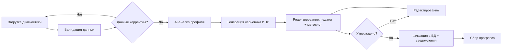

# Тестовое задание: Бизнес-аналитик + Project Manager
## Проект: AI-агент для автоматизации диагностики и ИПР детей с РАС/ОВЗ

> **Автор:** Машина Виктория Алексеевна  
> **Контакты:** mashina476@gmail.com  
> **Дата:** 17.04.2026  
> **Репозиторий:** `ai-agent-ras-pilot-test`

> **Рекомендация:** Файл PDF с заданием: file:///C:/Users/Windows/Desktop/Тестовое_задание_ProjectM_shavonnf.pdf

---

## 🎯 О проекте

**Цель:** Создать AI-агента для автоматизации обработки диагностических данных и генерации индивидуальных программ развития детей с РАС, чтобы сократить время специалистов на рутинную работу и снизить профессиональную нагрузку.

**Заказчик:** Сафронова Елизавета Сергеевна, руководитель проектов, Сбер  
**Техстек:** Python/Java, React.js, PostgreSQL, S3, GigaChat, SberCloud

---

## 1️⃣ Задача 1: Вопросы к заказчику и стейкхолдерам

### 📊 Блок 1: Бизнес и успех проекта

| № | Вопрос | Кому | Зачем | Риск |
|---|----------|------|-------|------|
| 1.1 | Как выглядит «успешный результат» через 2 месяца пилота? | Заказчик | Зафиксировать KPI и критерии успеха | Невозможно оценить успех проекта |
| 1.2 | Как будет измеряться сокращение времени на составление программы? Какие базовые метрики зафиксированы до внедрения? | Заказчик, методист, аналитик | Корректно настроить сбор метрик и доказать эффективность решения | Невозможность объективно оценить успех, споры о результате |

### 👥 Блок 2: Пользователи и процессы

| № | Вопрос | Кому | Зачем | Риск |
|---|----------|------|-------|------|
| 2.1 | Какие сценарии использования самые частые (топ-3)? | Педагоги, родители, аналитики | Сфокусироваться на ключевой ценности в пилоте | Делаем сложную систему, но не решаем основную боль |
| 2.2 | Как сейчас происходит передача данных между специалистами? | Педагоги, администраторы | Понять интеграции и точки потери данных | Если не учтем реальные процессы, система не приживется |
| 2.3 | Как должна работать синхронизация данных при конфликтах (например, два специалиста изменили один профиль)? Какой сценарий приоритетен: «последний изменил» или «требует подтверждения»? | Тех. команда, педагоги, методист | Спроектировать логику разрешения конфликтов и минимизировать потерю данных | Потеря важных данных о прогрессе ребёнка, демотивация пользователей |
| 2.4 | Какой минимальный набор функций должен быть в пилотной версии, чтобы специалисты согласились перейти с привычных Excel/бумаги? | Педагоги, психологи, тьюторы | Сфокусировать MVP на реальной ценности и обеспечить раннее принятие продукта | Низкий adoption rate: система готова, но ею не пользуются |
| 2.5 | Какие устройства и условия работы у пользователей (офлайн/онлайн)? | Педагоги, тьюторы | Спроектировать UX и офлайн-режим | Неудобная система → низкая вовлечённость |

### 🤖 Блок 3: AI-продукт

| № | Вопрос | Кому | Зачем | Риск |
|---|----------|------|-------|------|
| 3.1 | Как сейчас выглядит «идеальная» индивидуальная программа? | Методист, старший педагог | Понять эталон результата AI | AI будет генерировать «не то», что ожидают специалисты |
| 3.2 | Какие ошибки в рекомендациях AI недопустимы? | Заказчик, методисты | Задать границы ответственности AI | Юридические/этические проблемы, недоверие к системе |
| 3.3 | Какие критерии качества вы будете использовать для оценки рекомендаций AI-агента? Кто и как будет валидировать сгенерированные программы до их передачи ребёнку? | Методист, аналитик, заказчик | Определить метрики успеха модели и прописать процедуру человеческого контроля (human-in-the-loop) | Внедрение некорректных рекомендаций, снижение доверия, юридические риски |
| 3.4 | Кто принимает финальное решение по программе – AI или специалист? | Заказчик | Определить роль AI (ассистент vs автономная система) | Конфликт ролей, сопротивление пользователей |

### 🔐 Блок 4: Данные, безопасность и ответственность

| № | Вопрос | Кому | Зачем | Риск |
|---|----------|------|-------|------|
| 4.1 | Какие поля/данные обязательны для диагностики, а какие – опциональны? | Педагоги, психологи | Определить минимально жизнеспособный набор данных (MVP) | Система требует слишком много данных → пользователи не будут ей пользоваться |
| 4.2 | Какие требования по безопасности и хранению данных критичны? | Заказчик, юристы, тех. команда | Соблюдение 152-ФЗ и архитектура хранения | Блокировка проекта на уровне compliance |
| 4.3 | Какие именно данные считаются персональными в вашем контексте, и как должна выглядеть процедура их анонимизации перед передачей в AI-агент? | Заказчик, юрист, методист | Спроектировать корректный поток данных, соответствующий 152-ФЗ и политикам Сбера | Нарушение законодательства, блокировка на этапе проверки безопасности |
| 4.4 | Кто будет нести ответственность за ошибки в рекомендациях AI-агента: разработчик, методист, утверждающий программу, или организация? | Заказчик, юрист, руководитель проекта | Прописать регламенты использования и разграничить зоны ответственности | Юридические претензии, блокировка использования системы |

### 💡 Как я использую эти вопросы в работе
> Данный список вопросов используется не только для сбора требований, но и для проверки ключевых продуктовых гипотез:
> - Где создаётся основная бизнес-ценность
> - Какой минимальный функционал даст результат уже в пилоте
> - Какие риски могут привести к отказу пользователей или блокировке проекта
>
> **Ответы позволяют:**
> - Сформировать чёткий MVP
> - Определить требования к AI-агенту
> - Заложить метрики оценки эффективности
> - Снизить продуктовые и юридические риски на раннем этапе

---

## 2️⃣ Задача 2: Бизнес-процесс «Составление ИПР для ребёнка»

### 📋 Краткое описание
Процесс описывает путь от загрузки результатов диагностики до утверждения индивидуальной программы развития (ИПР) с участием педагога, методиста и AI-агента.

### 🔗 Интерактивная схема (Figma)
[👉 Открыть User Flow в Figma](https://drink-chaos-52135073.figma.site/)

### 🗺️ Основные этапы процесса

---

## 3️⃣ Задача 3: Дорожная карта пилота (2 месяца)

### 🗓️ Основные вехи

| Веха | Срок | Критерии готовности | Кто вовлечён | Риски и меры |
|------|------|-------------------|--------------|--------------|
| **1. Финализация требований и дизайн-сессия** | Неделя 1 | • Утверждённый бэклог пилота  • Прототипы ключевых экранов  • Согласованные метрики успеха | Бизнес-аналитик, Заказчик, Методист, 2–3 педагога, Дизайнер | **Риск:** расхождение в ожиданиях   **Мера:** воркшоп с демонстрацией прототипа и фиксацией «что не делаем в пилоте» |
| **2. Разработка MVP: ядро (ввод данных + AI-черновик)** | Недели 2–3 | • Рабочий прототип: загрузка диагностики → черновик ИПР  • Интеграция с GigaChat (тестовый контур)  • Базовая валидация данных | Разработчики (Backend/Frontend), ML-инженер, Бизнес-аналитик | **Риск:** низкое качество рекомендаций AI   **Мера:** ограничить пилот 1–2 методиками (ABLLS-R), использовать rule-based + LLM, а не чистый генератив |
| **3. Офлайн-режим + синхронизация + роли** | Недели 4–5 | • Работа формы ввода без интернета  • Автоматическая синхронизация при подключении  • Настроенные роли и права доступа | Разработчики, Тестировщик, Бизнес-аналитик | **Риск:** конфликты синхронизации   **Мера:** простая стратегия «последний изменяет» + лог изменений для ручного разрешения |
| **4. Внутреннее тестирование + обучение пилотной группы** | Неделя 6 | • Пройдены сценарии тестирования (юзабилити, нагрузка)  • Проведён тренинг для 5–7 специалистов  • Готовые инструкции и чек-листы | Тестировщик, Методист, Тренер, Пилотная группа педагогов | **Риск:** сопротивление изменениям   **Мера:** вовлечь педагогов в тестирование, собрать обратную связь и показать, что их правки учитываются |
| **5. Запуск пилота** | Недели 7–8 | • 5+ специалистов используют систему ежедневно  • Собранные метрики: время на ИПР, удовлетворённость  • Зафиксированные инциденты и план доработок | Все роли + Заказчик | **Риск:** технические сбои в реальных условиях   **Мера:** выделенный канал поддержки, ежедневный мониторинг, быстрый хотфикс-процесс |
| **6. Подведение итогов и решение о масштабировании** | Конец 8-й недели | • Отчёт по метрикам (экономия времени, качество)  • Список доработок для v2.0  • Решение заказчика о продолжении | Заказчик, Проектный менеджер, Бизнес-аналитик, Методист | **Риск:** неоднозначные результаты   **Мера:** заранее согласовать «порог успеха» (например, ≥25% экономии времени) |

### ⚠️ Ключевые риски пилота

| Риск | Описание | Как предусмотреть |
|------|----------|------------------|
| **Низкое качество рекомендаций AI** | Специалисты не доверяют системе | Валидация специалистом; использование шаблонов и правил; пилот на ограниченных кейсах |
| **Низкое качество данных на входе** | Педагоги вносят информацию неполно/с ошибками | Упростить формы ввода, добавить подсказки и валидацию в реальном времени, провести обучающий вебинар |
| **Низкое принятие системы пользователями** | Пользователи продолжают работать в Excel | Упрощённый MVP (1–2 ключевые функции); вовлечение пользователей; обучение и быстрый сбор обратной связи |

---

## 4️⃣ Задача 4: Процесс работы с заказчиком и командой

### 🔄 Подход к управлению
Мы будем использовать **итерационный подход** (короткие циклы с регулярной проверкой результата на пользователях). Это позволит:
- ✅ Быстро принимать решения на основе обратной связи
- ✅ Минимизировать недопонимание между бизнесом и разработкой
- ✅ Вовлекать пользователей уже на ранних этапах
- ✅ Своевременно корректировать продукт в рамках пилота

### 📅 Форматы встреч

| Формат встречи | Частота | Участники | Цель | Фокус |
|---------------|---------|-----------|------|-------|
| **Kick-off встреча** | 1 раз (старт проекта) | Вся команда, заказчик | Синхронизация целей, ожиданий, ролей | Цели проекта, KPI, зоны ответственности |
| **Еженедельный статус** (status meeting) | 1 раз в неделю | ПМ, команда, заказчик | Контроль прогресса | Что сделано, что планируется, риски |
| **Рабочие встречи** (work sessions) | 2–3 раза в неделю | Аналитик, разработчики, ML, дизайнер | Проработка требований и решений | Детализация задач, уточнение логики |
| **Демо** (demo / review) | 1 раз в 1–2 недели | Команда, заказчик, пользователи | Показ результата | Проверка соответствия ожиданиям |
| **Сбор обратной связи от пользователей** | Регулярно (в пилоте) | Педагоги, методисты, родители, аналитик | Улучшение продукта | Удобство, полезность, проблемы |
| **Ретроспектива** | 1 раз в 2 недели | Команда | Улучшение процесса | Что улучшить в работе команды |

### 💬 Каналы коммуникации

| Канал | Назначение |
|-------|------------|
| **Мессенджер** (Telegram/Slack) | Оперативные вопросы, быстрые согласования |
| **Таск-трекер** (Bitrix/Jira) | Задачи, статусы, приоритеты, дедлайны |
| **Документация** (Google Docs/Confluence) | Требования, решения, протоколы встреч, база знаний |
| **Демо-звонки** (Zoom/Teams) | Презентация результатов, обсуждение фидбека, принятие решений |

### 🔑 Принципы взаимодействия
- **Прозрачность**: все решения и изменения фиксируются в общем пространстве, доступном заказчику
- **Фокус на ценности**: каждое обсуждение привязано к метрикам успеха (время, качество, adoption rate)
- **Быстрая обратная связь**: блокеры эскалируются в течение 24 часов, решения — в течение 48 часов
- **Гибкость**: если пилот показывает, что гипотеза не подтверждается — оперативно корректируем план, а не «дожимаем» неработающее

---

## 💡 Мотивация

### 1. Почему мне интересен этот проект?

Мне интересен данный проект, так как он находится на пересечении **образования**, **социальной сферы** и **технологий искусственного интеллекта**, что делает его актуальным, профессионально насыщенным и перспективным для роста и личного развития.

В данный момент я обучаюсь в области **международного менеджмента образования**, а также имею базовое педагогическое образование, поэтому тема разработки решений для повышения качества образовательной и коррекционной помощи детям с ОВЗ для меня профессионально значима.

Особенно ценно, что проект решает **реальную проблему специалистов** — высокую нагрузку и большое количество рутинной работы (как педагог я очень понимаю эту боль). Но самое главное – реализация этого проекта **поможет детям**. В этом состоит гуманистическая миссия данного продукта.

### 2. Как я вижу свою роль в команде?

Я вижу свою роль как **связующее звено (мост)** между бизнес-задачами, пользователями и командой разработки:

| Этап | Моя деятельность |
|------|-----------------|
| **Начало** | Глубокое погружение в контекст специалистов, перевод их болей в чёткие требования и пользовательские истории |
| **Основной этап** | Приоритизация, контроль, что каждая фича решает конкретную задачу из кейса, а не «просто добавлена» |
| **Завершение** | Помощь в измерении результата через метрики, сбор обратной связи, подготовка решения к масштабированию |

> **Моя главная цель** — чтобы продукт был не только технически исправным, но и реально используемым, потому что он упрощает жизнь тем, кто помогает детям, а главное – он улучшит жизнь самих детей и их будущее.

Так как для меня это первый практический проект в такой роли, я особенно заинтересована в быстром погружении, обучении и работе с обратной связью, чтобы максимально эффективно приносить пользу команде.

### 3. Сколько времени я готова уделять проекту?

| Период | Часов в неделю | Комментарий |
|--------|---------------|-------------|
| **Пилотный этап (2 месяца)** | 15–20 часов | Комфортный режим при совмещении с работой и учёбой, позволяет работать без потери мотивации |
| **После пилота (при развитии проекта)** | Готовы рассмотреть увеличение | В зависимости от формата сотрудничества и конкретных условий |

> Обозначенные рамки позволяют мне сохранять высокий уровень вовлечённости и качества работы, а также делать в итоге идеальный продукт. При необходимости я готова обсудить расширение временных границ.

---

> *Раздел подготовлен в рамках тестового задания на позицию Бизнес-аналитик + Project Manager*
